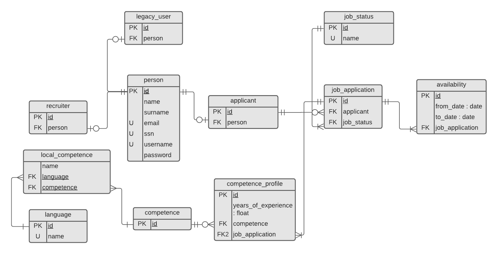

# Recruitment Application Contribution Guide
This document shows an overview of the project and lists the contributing
instructions for developing new functionality.

## Table of Contents
 - [1. Architecture](#1-architecture)
    - [1.1. Spring Boot Application](#11-spring-boot-application)
    - [1.2. SQL Database](#12-sql-database)
 - [2. Adding New Feature](#2-adding-new-feature)
 - [3. Fixing Issues](#3-fixing-issues)
 - [4. Coding Conventions](#4-coding-conventions)
 - [5. Testing](#5-testing)

## 1. Architecture
The following sections lists architectures of various components of the
recruitment application.

## 1.1. Spring Boot Application
The following architecture is a WIP. For more details related to a specific
class or method, see the javadoc.

These packages are located under [`src/main/java/se/kth/iv1201/group4/recruitment`](src/main/java/se/kth/iv1201/group4/recruitment).
 - **application**: Contains application-scope classes global to the recruitment application, mainly
                    service classes for accessing application-scope data structures.
 - **config**: Contains Spring Boot configuration classes for, for example, authentication and
               thymeleaf view resolution.
 - **domain**: Contains business logic and entity classes used by JPA
 - **dto**: Contains Data Transfer Object abstraction interfaces for each entity class.
 - **presentation**: Contains servlet controllers for each view and classes representing
                     HTML post forms.
 - **repository**: Contains various repository classes responsible for fetching and writing data
                   to the database.

## 1.2. SQL Database

## 2. Adding New Feature
To add a new feature, start by creating a new branch `feature/<feature-name>` and start coding. Open a
Pull Request (PR), preferably as soon as possible so that others can see the changes that you've made, but
mark it as a draft until it is finished. The PR should be merged into the development branch, `dev`,
**not** the `main` branch, so make sure to select the `dev` branch as the destination branch. Once
the PR is ready for merge and has passed the CI pipeline, ask someone to review your changes. If they
approve the PR it may be merged, but remember to select "Squash and Merge" to not fill up the development
branch with potentially low level or non-constructive commits. Remember to delete the feature branch after
its PR has been merged!

Once the development branch has enough cohesive features and is fully functional, a PR is opened with the
`main` branch as the destination branch.  Note that the "Squash and Merge" option is not necessary for this PR,
"Create a Merge Commit" is fine. Once the PR is merged, the CI pipeline will take care of deployment to Heroku.

## 3. Fixing Issues
If a bug is found, an issue may be opened that explains what the issue is and what the steps are to
reproduce it. To resolve the issue, the same procedure as described in section 2 should be followed, with
the exceptions being that the branch name should be `issue/<issue-name>` and that the issue should
be linked to the PR by editing "Linked Issues" from the PR page.

## 4. Coding Conventions
If the some code violates these conventions, it means that the code is wrong, not that
the coding conventions are irrelevant or outdated.
- Variables, methods, and folders are named with **camelCase**.
- Java source files and classes are named with **PascalCase**.
- Other source files are named with **camelCase**.
- Files generated by tooling use their respective conventions.
- Constants are named with **capitalized snake_case**. (ex. THIS_IS_A_CONSTANT)
- Opening brackets are placed on a new line for classes, but not
  for `for`, `while`, `if` blocks, and functions.
- Brackets are not required for `if`, `while` and `for` loops containing
  just one line of code.
- Tab size is 4 spaces.

## 5. Testing
A feature branches must be properly tested before their PRs can be merged. In general, there must be a test
for each public method, excpet for simple getters and setters, and it should test both invalid and valid inputs
to all methods in the source file. Spring MockMVC may be used to simulate HTTP transactions.
